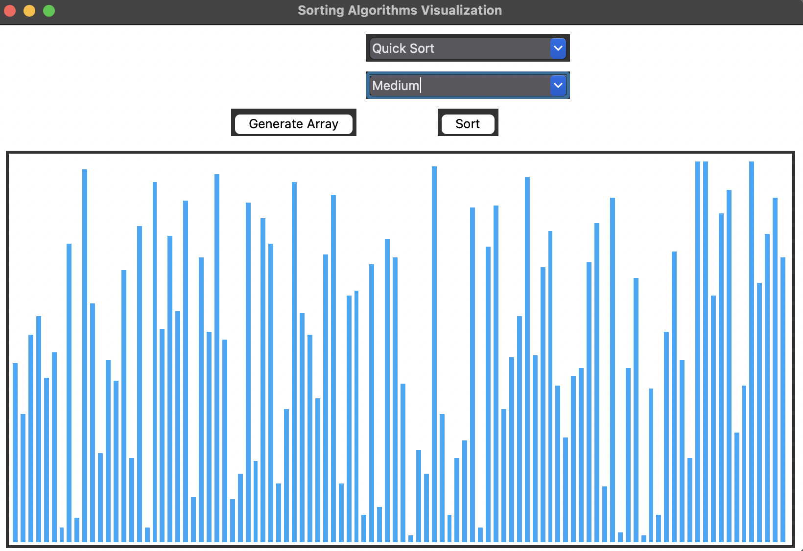

# Sorting Algorithm Visualizer

This program visually demonstrates various sorting algorithms in action. It helps to understand how different sorting algorithms work and compare their performance.

## Algorithms Implemented

- Bubble Sort
- Selection Sort
- Insertion Sort
- Merge Sort
- Quicksort

## How to Run

- Install Python 3 
- Install the required libraries: `tkinter`, `random`
- Run the `main.py` file:

```
python main.py
```

- A GUI window will open where you can:
  - Select the sorting algorithm from the dropdown 
  - Choose the sorting speed from Slow, Medium or Fast
  - Click "Generate Array" to generate a random array of numbers
  - Click "Sort!" to visualize the sorting process step by step
  - The array is represented by bars of different heights, and they will change in real time as the algorithm executes

## How it Works

The program uses the `tkinter` library to create the GUI and `random` library to generate random arrays.

For each sorting algorithm, there is a corresponding Python file that implements the algorithm logic and calls the `drawData()` function at each step to update the GUI with the new array state.

The `drawData()` function redraws the array bars based on the input data list and color.

The speed of the animation is determined by the time interval set using the `set_speed()` function based on the selected speed from the dropdown.

## Screenshots



## License

MIT
